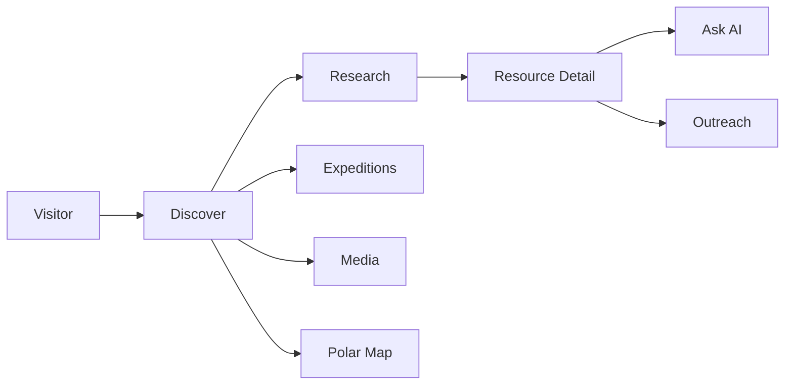
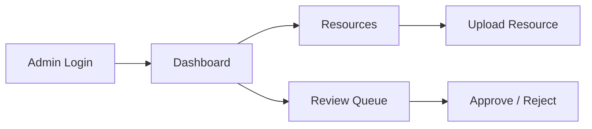
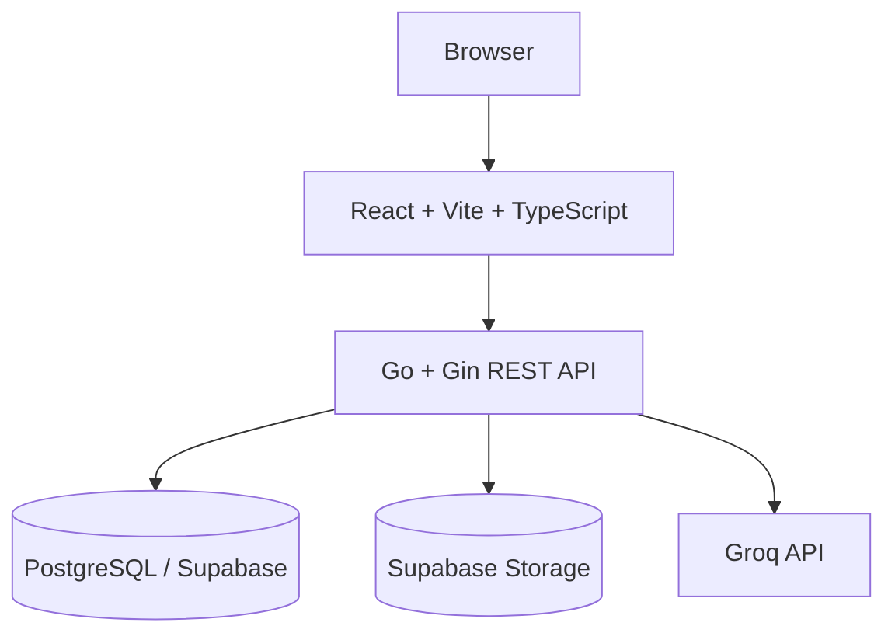

<div align="center">
  
  <h1>AICYGRAM</h1>
  <p><strong>Integrated Polar Science Outreach, Knowledge Repository and Media Dissemination Portal</strong></p>
</div>

> A digital platform for discovering, organizing and communicating polar science through research resources, expedition records, media, source-grounded AI and human-reviewed outreach content.

[Live Demo: https://aicygram.vercel.app](https://aicygram.vercel.app)


---

## Overview

AICYGRAM is an integrated full-stack software application built to tackle the challenges of archiving, contextualizing, and disseminating polar research data to the public. Designed in response to SIH26063, it combines a robust backend knowledge repository with frontend discovery tools and a source-grounded AI engine capable of assisting researchers and generating accessible outreach material.

## Problem

**SIH26063 — Integrated Polar Science Outreach, Knowledge Repository and Media Dissemination Portal**
Organization: **Ministry of Earth Sciences (MoES)**
Department: **National Centre for Polar and Ocean Research (NCPOR)**

Polar research spans complex, multi-disciplinary expeditions resulting in vast amounts of scientific datasets, publications, reports, photographs, and videos. The challenge lies in efficiently organizing this institutional knowledge while making it accessible and engaging for both internal researchers and public outreach, including generating content for websites and social media platforms.

## Solution

AICYGRAM functions as an integrated pipeline rather than isolated pages. 

The core flow is:
`Scientific Research ↓ Knowledge Repository ↓ Discovery ↓ Source-Grounded AI ↓ Outreach Generation ↓ Human Review ↓ Publication / Dissemination State`

A piece of research uploaded to the repository becomes instantly searchable, associated with its originating polar expedition, and available as context for the Ask AI feature. That same AI can generate audience-tailored outreach content which is then entered into a protected Admin review queue for human approval.

## Key Features

### Research Discovery
- Searchable resource repository backed by PostgreSQL full-text search.
- Filtering by resource type and geographic region.
- Resource detail pages featuring embedded PDFs and document viewers.
- Related resource navigation establishing research provenance.

### Expeditions
- Dedicated listing for polar expeditions (Arctic, Antarctica, Himalayas, Southern Ocean).
- Contextual association showing what research was produced during specific expeditions.
- Visual mapping placeholders and expedition metadata (duration, region, coordinates).

### Ask AI
- Contextual, source-grounded questioning directly referencing the repository.
- Uses selected resources to formulate answers.
- Cites specific indexed source documents to prevent hallucination.
- Includes clear disclaimers encouraging human verification of cited material.

### Outreach & Review Workflow
- Generates audience-aware content (e.g., General Public, High School Students) from selected repository context.
- Formats outputs as Social Cards or Lesson Plans.
- Submits generated content directly into the protected Admin Review Queue as a "DRAFT".
- Provides a protected Admin Dashboard for human reviewers to Approve or Reject the synthesized drafts.

### Media & Polar Map
- Dedicated media gallery.
- Showcases curated external polar-science videos with precise source attribution.
- Interactive Leaflet-based map visualizing station/expedition areas (using prototype demonstration data).

### Administration
- Protected admin routes authenticated via JWT and bcrypt.
- Repository management and resource inspection.
- Supabase Storage-backed file uploads.

## User Journey



## Admin Workflow



## System Architecture



## Technology Stack

| Layer          | Technology       | Purpose                |
| -------------- | ---------------- | ---------------------- |
| Frontend       | React            | User interface         |
| Build          | Vite             | Frontend build tooling |
| Language       | TypeScript       | Type-safe frontend     |
| Styling        | Tailwind CSS     | UI styling             |
| Routing        | React Router     | Client routing         |
| Backend        | Go               | REST API               |
| Framework      | Gin              | HTTP routing           |
| Database       | PostgreSQL       | Repository persistence |
| Storage        | Supabase Storage | Resource files         |
| AI             | Groq             | AI generation          |
| Authentication | JWT + bcrypt     | Admin authentication   |
| Maps           | Leaflet          | Polar map visualization|

## Architecture Highlights

* **REST API Boundary:** The React frontend communicates strictly with the Go backend via stateless REST APIs.
* **PostgreSQL Full-Text Search:** The repository leverages PostgreSQL's `websearch_to_tsquery` and `plainto_tsquery` via a GIN index on a `search_vector` column to provide highly relevant document search with intelligent `OR` query fallbacks.
* **Backend-Mediated AI:** Groq API calls are handled entirely server-side, protecting API keys and allowing the backend to meticulously compile search results and resource context before asking the LLM.
* **Supabase Integration:** Both PostgreSQL and Cloud Storage are managed through Supabase for scalable remote access.
* **Admin Authorization:** Sensitive endpoints require a valid JWT token generated after comparing hashed (bcrypt) credentials. Frontend routes are protected by checking local authentication state.

## API Overview

**Authentication**
* `POST /api/auth/login`

**Resources & Discovery**
* `GET /api/resources`
* `GET /api/resources/:id`
* `POST /api/resources`
* `POST /api/resources/:id/upload`
* `GET /api/resources/:id/relations`
* `POST /api/resources/:id/relations`
* `GET /api/search`

**Expeditions & Media**
* `GET /api/expeditions`
* `GET /api/expeditions/:id`
* `POST /api/expeditions`
* `GET /api/media`

**Activities & Curriculum**
* `GET /api/activities`
* `GET /api/curriculum/concepts`
* `GET /api/curriculum/concepts/:id/resources`
* `GET /api/curriculum/lesson-plans`
* `POST /admin/curriculum/tags`
* `DELETE /admin/curriculum/tags/:id/:resourceId`

**AI Generation**
* `POST /api/ai/ask`
* `POST /api/ai/outreach`
* `POST /api/ai/lesson-plan`
* `POST /api/ai/social-card`
* `POST /api/ai/social-card/:id/render`

**Review Queue**
* `GET /api/review/queue`
* `POST /api/review/:id/approve`
* `POST /api/review/:id/reject`

## Authentication

Public users can access research discovery, expedition pages, media viewing, and contextual AI features without registration.

AICYGRAM does not implement public user registration. Administrators must log in with established credentials (verified via bcrypt against the database) to receive a JWT. This token is required to access protected routes (`/admin/*`) and to perform destructive or state-changing repository actions.

## AI / Source-Grounded Assistance

AICYGRAM implements a source-grounded LLM strategy (RAG-lite) using the Groq API. 

When a user submits a question via "Ask AI", the backend intercepts the query and queries the PostgreSQL database using full-text search. It extracts relevant indexed resources, concatenates their content into an augmented context block, and instructs the LLM to answer *exclusively* based on the provided material. The API then returns both the synthesized answer and the explicit IDs of the sources used, which the frontend displays as clickable citations.

## AI Limitation / Disclaimer

The UI explicitly reminds users that responses are generated from available indexed sources and should be reviewed against the cited material.

While source-grounding greatly reduces hallucinations, AI-generated answers can still be imperfect. The AI feature is designed as a discovery and assistance layer to help navigate dense research, not as a definitive substitute for scientific review or primary source reading.

## Media / Image Sources

**External Media:** Curated external educational and scientific videos (e.g., from the U.S. National Science Foundation) are linked to their original hosting platforms with prominent source attribution. AICYGRAM does not own these external assets and does not claim official partnership. See `VIDEO_SOURCES.md` for exact tracking.

**Images:** Major visual assets (hero images, expedition covers) are documented with source/licensing information where applicable. See `IMAGE_SOURCES.md` for details.

## Current Limitations

* **Media Gallery:** The backend `/api/media` repository endpoint may currently return prototype or empty data outside of the specifically curated external videos.
* **Map Data:** Station map locations utilize prototype demonstration data. Live telemetry or real-time tracking is not currently implemented.
* **Outreach Publishing:** The Review Queue records Approve/Reject states, but does not yet feature automated external publishing hooks to social media platforms.

## Security Notes

* All critical service secrets (JWT Secret, Groq API Key, Supabase Service Key, DB credentials) remain strictly on the backend.
* The frontend solely consumes the secure REST API.
* Authentication routes issue short-lived JWTs.
* Note: This is an active hackathon project. Previously exposed credentials or test passwords in the codebase should be rotated before any actual production deployment.

## Project Structure

```text
.
├── backend/
│   ├── cmd/
│   ├── internal/
│   │   ├── api/
│   │   ├── handlers/
│   │   ├── models/
│   │   ├── repository/
│   │   ├── services/
│   ├── migrations/
│   ├── Dockerfile
│   └── go.mod
├── frontend/
│   ├── public/
│   ├── src/
│   │   ├── components/
│   │   ├── pages/
│   │   ├── services/
│   ├── package.json
│   └── vite.config.ts
├── docker-compose.yml
├── IMAGE_SOURCES.md
├── VIDEO_SOURCES.md
└── README.md
```

## Environment Variables

To run the project, create `.env` files based on the actual repository `.env` templates. Do not expose actual secrets.

**Backend (`backend/.env`):**
```env
PORT=
DATABASE_URL=
JWT_SECRET=
GROQ_API_KEY=
SUPABASE_URL=
SUPABASE_SERVICE_KEY=
```

**Frontend (`frontend/.env.local`):**
```env
VITE_API_BASE_URL=
```

## Getting Started

### Prerequisites
* Node.js & npm
* Go 1.22+
* Docker (for local PostgreSQL database)

### Database Setup
A local PostgreSQL database can be spun up using the included `docker-compose.yml`. This automatically mounts the `/backend/migrations` folder to initialize the schema.
```bash
docker compose up -d
```
*(Alternatively, configure `DATABASE_URL` to point to a remote Supabase instance.)*

### Running the Backend
```bash
cd backend
go mod download
go run cmd/server/main.go
```

### Running the Frontend
```bash
cd frontend
npm install
npm run dev
```

## Deployment

**Verified Deployments:**
* **Frontend:** Deployed to Vercel (https://aicygram.vercel.app). 

**Configured Services:**
* **Database/Storage:** Configured on Supabase (PostgreSQL + Cloud Storage).
* **AI:** Integrated with the Groq API.

**Not Verified:**
* **Backend:** Render deployment is supported via Dockerfile, but a live public Render URL has not yet been verified for this repository.

## Recommended Demo Flow

1. Open the AICYGRAM home page.
2. Explore the **Research** repository to view filtered datasets and publications.
3. Open a specific resource detail page.
4. Open the **Ask AI** panel and ask a contextual question; note the cited source references.
5. Move to the **Expeditions** tab and view the visual prototype data.
6. Check out the **Media** tab to see integrated, properly-attributed external videos.
7. Log in to the protected **Admin** dashboard.
8. View the **Review Queue** to demonstrate human-in-the-loop validation of generated outreach content.

## Project Status

**Active Hackathon Development**

---
*Maintained as a software solution for Smart India Hackathon (SIH26063).*
