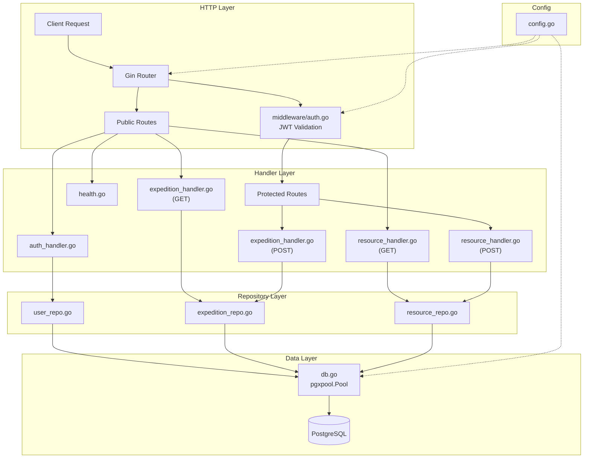

# Phase 3: Core CRUD API — Step-by-Step Implementation Plan

## Goal

Build the full working REST API layer for expeditions, resources, and authentication. After this phase, every data-driven page in the frontend can be wired to a real backend instead of mock data.

**Endpoints delivered:**

| Method | Endpoint | Auth | Purpose |
|--------|----------|------|---------|
| `POST` | `/api/auth/login` | ❌ | Admin login → JWT |
| `GET` | `/api/expeditions` | ❌ | List expeditions (with `?region=` & `?year=` filters) |
| `GET` | `/api/expeditions/:id` | ❌ | Expedition detail + linked resources |
| `POST` | `/api/expeditions` | ✅ | Create expedition |
| `GET` | `/api/resources` | ❌ | List resources (with `?type=`, `?region=`, `?year=`, `?status=` filters) |
| `GET` | `/api/resources/:id` | ❌ | Resource detail + linked expedition(s) |
| `POST` | `/api/resources` | ✅ | Create resource |

---

## User Review Required

> [!IMPORTANT]
> **Schema deviation from original action plan**: The current migrations use `SERIAL` integer IDs (not UUIDs) and `VARCHAR` resource IDs (e.g., `'RPT-2024-001'`). The models and repositories in this plan are built to match the **actual schema that exists**, not the UUID-based plan. This is intentional — changing the schema now would break the seed data.

> [!IMPORTANT]
> **JWT dependency**: This plan adds `github.com/golang-jwt/jwt/v5` and `golang.org/x/crypto` (for bcrypt) as new Go dependencies. The `.env` file needs a `JWT_SECRET` value added.

> [!WARNING]
> **Missing Phase 1 files**: The current project is missing `internal/config/`, `internal/routes/`, and `internal/handlers/` directories that Phase 1 was supposed to create. This plan creates them as part of Phase 3 since they are prerequisites for the CRUD handlers. The `main.go` will also be refactored to use the new `routes` package.

---

## Open Questions

> [!IMPORTANT]
> **JWT token expiry duration**: The plan defaults to **24 hours**. Should this be shorter (e.g., 2 hours) or longer for development convenience?

> [!IMPORTANT]
> **Resource ID format**: The current schema uses human-readable string IDs like `'RPT-2024-001'`. Should `POST /api/resources` auto-generate IDs in this format, or should the client provide the ID? This plan assumes **client-provided IDs** since the format is domain-specific.

---

## Current State Analysis

### What exists and works
| File | Lines | Status |
|------|-------|--------|
| [go.mod](file:///home/redd/Projects/PolarSetu/backend/go.mod) | 46 | ✅ Has Gin, pgx, godotenv deps |
| [cmd/server/main.go](file:///home/redd/Projects/PolarSetu/backend/cmd/server/main.go) | 38 | ✅ Health endpoint inline, DB connect |
| [internal/db/db.go](file:///home/redd/Projects/PolarSetu/backend/internal/db/db.go) | 33 | ✅ Global `Pool` via pgxpool |
| [internal/models/models.go](file:///home/redd/Projects/PolarSetu/backend/internal/models/models.go) | 59 | ⚠️ Has User/Expedition/Resource/Activity/Media but uses `int` IDs for some, `string` for others |
| [migrations/001_init_schema.sql](file:///home/redd/Projects/PolarSetu/backend/migrations/001_init_schema.sql) | 99 | ✅ All tables created |
| [migrations/002_seed_data.sql](file:///home/redd/Projects/PolarSetu/backend/migrations/002_seed_data.sql) | 35 | ✅ Admin user + expeditions + resources + links seeded |
| [.env](file:///home/redd/Projects/PolarSetu/backend/.env) | 4 | ⚠️ Missing JWT_SECRET |

### What does NOT compile
All four service stubs (`ai.go`, `search.go`, `storage.go`, `provenance.go`) are **0 bytes** — no `package` declaration. The project fails `go build` because of these.

### What needs to be created
| Directory/File | Purpose |
|------|---------|
| `internal/config/config.go` | Centralized env config struct |
| `internal/repository/expedition_repo.go` | Expedition DB queries |
| `internal/repository/resource_repo.go` | Resource DB queries |
| `internal/repository/user_repo.go` | User DB queries |
| `internal/handlers/health.go` | Extract health handler from main |
| `internal/handlers/expedition_handler.go` | Expedition HTTP handlers |
| `internal/handlers/resource_handler.go` | Resource HTTP handlers |
| `internal/handlers/auth_handler.go` | Login handler |
| `internal/middleware/auth.go` | JWT validation middleware |
| `internal/routes/routes.go` | Central route registration |

---

## Proposed Changes

Build order follows strict dependency chain: **Fix Stubs → Config → Models Fix → Repository → Middleware → Handlers → Routes → Main Refactor**.

---

### Step 1: Fix Empty Service Stubs (Unblock Compilation)

The four empty service files prevent `go build` from succeeding. Add minimal package declarations so the project compiles before we add anything else.

#### [MODIFY] `internal/services/ai.go`
```go
package services

// AI service will be implemented in Phase 5.
```

#### [MODIFY] `internal/services/search.go`
```go
package services

// Search service will be implemented in Phase 4.
```

#### [MODIFY] `internal/services/storage.go`
```go
package services

// Storage service will be implemented in Phase 6.
```

#### [MODIFY] `internal/services/provenance.go`
```go
package services

// Provenance service will be implemented in Phase 6.
```

**✅ Checkpoint**: `go build ./...` should now succeed.

---

### Step 2: Add JWT and Bcrypt Dependencies

#### [MODIFY] `go.mod` (via `go get`)
```bash
cd backend
go get github.com/golang-jwt/jwt/v5
go get golang.org/x/crypto/bcrypt
go mod tidy
```

#### [MODIFY] `.env`
Add `JWT_SECRET`:
```env
# Backend Environment Configuration
PORT=8080
DATABASE_URL=postgres://polarsetu:ps@localhost:5432/polarsetu?sslmode=disable
JWT_SECRET=polarsetu-dev-secret-change-in-production
```

---

### Step 3: Create Centralized Config

#### [NEW] `internal/config/config.go`

Loads all environment variables into a typed struct. Replaces scattered `os.Getenv` calls.

```go
package config

import (
    "log"
    "os"

    "github.com/joho/godotenv"
)

type Config struct {
    Port        string
    DatabaseURL string
    JWTSecret   string
    GroqAPIKey  string
    SupabaseURL string
    SupabaseKey string
}

func Load() *Config {
    if err := godotenv.Load(".env"); err != nil {
        log.Println("No .env file found. Reading config from environment variables.")
    }

    cfg := &Config{
        Port:        getEnv("PORT", "8080"),
        DatabaseURL: getEnvRequired("DATABASE_URL"),
        JWTSecret:   getEnvRequired("JWT_SECRET"),
        GroqAPIKey:  os.Getenv("GROQ_API_KEY"),
        SupabaseURL: os.Getenv("SUPABASE_URL"),
        SupabaseKey: os.Getenv("SUPABASE_KEY"),
    }

    return cfg
}

func getEnv(key, fallback string) string {
    if v := os.Getenv(key); v != "" {
        return v
    }
    return fallback
}

func getEnvRequired(key string) string {
    v := os.Getenv(key)
    if v == "" {
        log.Fatalf("Required environment variable %s is not set", key)
    }
    return v
}
```

---

### Step 4: Fix Models to Match Actual Schema

The current [models.go](file:///home/redd/Projects/PolarSetu/backend/internal/models/models.go) has type mismatches with the actual DB schema. Key issues:

| Field | Current Model | Actual Schema | Fix |
|-------|--------------|---------------|-----|
| `User.ID` | `int` | `SERIAL` (int) | ✅ OK |
| `Expedition.ID` | `int` | `SERIAL` (int) | ✅ OK |
| `Expedition.StartDate` | `time.Time` | `DATE` (nullable) | → `*time.Time` |
| `Expedition.EndDate` | `time.Time` | `DATE` (nullable) | → `*time.Time` |
| `Resource.ID` | `string` | `VARCHAR(50)` | ✅ OK |

#### [MODIFY] `internal/models/models.go`

Replace the full file with corrected types and add missing models for API request/response:

```go
package models

import "time"

// ─── Database Models ─────────────────────────────────────────

type User struct {
    ID           int       `json:"id"`
    Email        string    `json:"email"`
    PasswordHash string    `json:"-"`
    Role         string    `json:"role"`
    CreatedAt    time.Time `json:"created_at"`
}

type Expedition struct {
    ID        int        `json:"id"`
    Name      string     `json:"name"`
    Region    string     `json:"region"`
    Year      int        `json:"year"`
    StartDate *time.Time `json:"start_date"`
    EndDate   *time.Time `json:"end_date"`
    Objective string     `json:"objective"`
    Latitude  float64    `json:"latitude"`
    Longitude float64    `json:"longitude"`
    SourceURL string     `json:"source_url"`
    CreatedAt time.Time  `json:"created_at"`
}

type Resource struct {
    ID          string    `json:"id"`
    Type        string    `json:"type"`
    Title       string    `json:"title"`
    Description string    `json:"description"`
    Year        int       `json:"year"`
    Region      string    `json:"region"`
    SourceURL   string    `json:"source_url"`
    StoragePath string    `json:"storage_path"`
    License     string    `json:"license"`
    Status      string    `json:"status"`
    CreatedAt   time.Time `json:"created_at"`
}

type ResourceChunk struct {
    ID         int    `json:"id"`
    ResourceID string `json:"resource_id"`
    PageNumber *int   `json:"page_number"`
    Section    string `json:"section"`
    Content    string `json:"content"`
}

type ResourceExpedition struct {
    ResourceID   string `json:"resource_id"`
    ExpeditionID int    `json:"expedition_id"`
}

type ResourceRelation struct {
    FromResourceID string `json:"from_resource_id"`
    ToResourceID   string `json:"to_resource_id"`
    RelationType   string `json:"relation_type"`
}

type Activity struct {
    ID          int        `json:"id"`
    Title       string     `json:"title"`
    Date        *time.Time `json:"date"`
    Description string     `json:"description"`
    SourceURL   string     `json:"source_url"`
    MediaURL    string     `json:"media_url"`
    CreatedAt   time.Time  `json:"created_at"`
}

type Media struct {
    ID          int    `json:"id"`
    ResourceID  string `json:"resource_id"`
    MediaType   string `json:"media_type"`
    URL         string `json:"url"`
    Caption     string `json:"caption"`
    Attribution string `json:"attribution"`
}

// ─── API Request / Response Types ────────────────────────────

type LoginRequest struct {
    Email    string `json:"email" binding:"required,email"`
    Password string `json:"password" binding:"required"`
}

type LoginResponse struct {
    Token string `json:"token"`
    User  User   `json:"user"`
}

type CreateExpeditionRequest struct {
    Name      string  `json:"name" binding:"required"`
    Region    string  `json:"region" binding:"required"`
    Year      int     `json:"year" binding:"required"`
    StartDate string  `json:"start_date"`
    EndDate   string  `json:"end_date"`
    Objective string  `json:"objective"`
    Latitude  float64 `json:"latitude"`
    Longitude float64 `json:"longitude"`
    SourceURL string  `json:"source_url"`
}

type CreateResourceRequest struct {
    ID          string `json:"id" binding:"required"`
    Type        string `json:"type" binding:"required"`
    Title       string `json:"title" binding:"required"`
    Description string `json:"description"`
    Year        int    `json:"year"`
    Region      string `json:"region"`
    SourceURL   string `json:"source_url"`
    License     string `json:"license"`
}

// ExpeditionDetail wraps an expedition with its linked resources.
type ExpeditionDetail struct {
    Expedition
    Resources []Resource `json:"resources"`
}

// ResourceDetail wraps a resource with its linked expeditions.
type ResourceDetail struct {
    Resource
    Expeditions []Expedition `json:"expeditions"`
}

type ErrorResponse struct {
    Error struct {
        Code    string `json:"code"`
        Message string `json:"message"`
    } `json:"error"`
}
```

---

### Step 5: Create Repository Layer

The repository layer encapsulates all raw SQL queries. Each repository takes `*pgxpool.Pool` as a dependency.

#### [NEW] `internal/repository/user_repo.go`

```go
package repository

import (
    "context"

    "PolarSetu/internal/models"

    "github.com/jackc/pgx/v5/pgxpool"
)

type UserRepo struct {
    pool *pgxpool.Pool
}

func NewUserRepo(pool *pgxpool.Pool) *UserRepo {
    return &UserRepo{pool: pool}
}

// GetByEmail retrieves a user by email address (includes password_hash for auth).
func (r *UserRepo) GetByEmail(ctx context.Context, email string) (*models.User, error) {
    var u models.User
    err := r.pool.QueryRow(ctx,
        `SELECT id, email, password_hash, role, created_at
         FROM users WHERE email = $1`, email,
    ).Scan(&u.ID, &u.Email, &u.PasswordHash, &u.Role, &u.CreatedAt)
    if err != nil {
        return nil, err
    }
    return &u, nil
}
```

#### [NEW] `internal/repository/expedition_repo.go`

```go
package repository

import (
    "context"
    "fmt"
    "strings"

    "PolarSetu/internal/models"

    "github.com/jackc/pgx/v5/pgxpool"
)

type ExpeditionRepo struct {
    pool *pgxpool.Pool
}

func NewExpeditionRepo(pool *pgxpool.Pool) *ExpeditionRepo {
    return &ExpeditionRepo{pool: pool}
}

// ListAll returns expeditions with optional region and year filters.
func (r *ExpeditionRepo) ListAll(ctx context.Context, region string, year int) ([]models.Expedition, error) {
    query := `SELECT id, name, region, year, start_date, end_date,
                     objective, latitude, longitude, source_url, created_at
              FROM expeditions WHERE 1=1`
    args := []interface{}{}
    argIdx := 1

    if region != "" {
        query += fmt.Sprintf(" AND LOWER(region) = LOWER($%d)", argIdx)
        args = append(args, region)
        argIdx++
    }
    if year > 0 {
        query += fmt.Sprintf(" AND year = $%d", argIdx)
        args = append(args, year)
        argIdx++
    }

    query += " ORDER BY year DESC, name ASC"

    rows, err := r.pool.Query(ctx, query, args...)
    if err != nil {
        return nil, err
    }
    defer rows.Close()

    var expeditions []models.Expedition
    for rows.Next() {
        var e models.Expedition
        if err := rows.Scan(&e.ID, &e.Name, &e.Region, &e.Year,
            &e.StartDate, &e.EndDate, &e.Objective,
            &e.Latitude, &e.Longitude, &e.SourceURL, &e.CreatedAt); err != nil {
            return nil, err
        }
        expeditions = append(expeditions, e)
    }
    return expeditions, rows.Err()
}

// GetByID returns a single expedition by ID.
func (r *ExpeditionRepo) GetByID(ctx context.Context, id int) (*models.Expedition, error) {
    var e models.Expedition
    err := r.pool.QueryRow(ctx,
        `SELECT id, name, region, year, start_date, end_date,
                objective, latitude, longitude, source_url, created_at
         FROM expeditions WHERE id = $1`, id,
    ).Scan(&e.ID, &e.Name, &e.Region, &e.Year,
        &e.StartDate, &e.EndDate, &e.Objective,
        &e.Latitude, &e.Longitude, &e.SourceURL, &e.CreatedAt)
    if err != nil {
        return nil, err
    }
    return &e, nil
}

// Create inserts a new expedition and returns it with the generated ID.
func (r *ExpeditionRepo) Create(ctx context.Context, req models.CreateExpeditionRequest) (*models.Expedition, error) {
    var e models.Expedition

    // Parse optional date strings
    var startDate, endDate interface{}
    if req.StartDate != "" {
        startDate = req.StartDate
    }
    if req.EndDate != "" {
        endDate = req.EndDate
    }

    err := r.pool.QueryRow(ctx,
        `INSERT INTO expeditions (name, region, year, start_date, end_date,
                                  objective, latitude, longitude, source_url)
         VALUES ($1, $2, $3, $4, $5, $6, $7, $8, $9)
         RETURNING id, name, region, year, start_date, end_date,
                   objective, latitude, longitude, source_url, created_at`,
        req.Name, req.Region, req.Year, startDate, endDate,
        req.Objective, req.Latitude, req.Longitude, req.SourceURL,
    ).Scan(&e.ID, &e.Name, &e.Region, &e.Year,
        &e.StartDate, &e.EndDate, &e.Objective,
        &e.Latitude, &e.Longitude, &e.SourceURL, &e.CreatedAt)
    if err != nil {
        return nil, err
    }
    return &e, nil
}

// GetResourcesByExpeditionID returns all resources linked to an expedition.
func (r *ExpeditionRepo) GetResourcesByExpeditionID(ctx context.Context, expeditionID int) ([]models.Resource, error) {
    rows, err := r.pool.Query(ctx,
        `SELECT r.id, r.type, r.title, r.description, r.year, r.region,
                r.source_url, r.storage_path, r.license, r.status, r.created_at
         FROM resources r
         JOIN resource_expedition re ON r.id = re.resource_id
         WHERE re.expedition_id = $1
         ORDER BY r.year DESC`, expeditionID,
    )
    if err != nil {
        return nil, err
    }
    defer rows.Close()

    var resources []models.Resource
    for rows.Next() {
        var res models.Resource
        if err := rows.Scan(&res.ID, &res.Type, &res.Title, &res.Description,
            &res.Year, &res.Region, &res.SourceURL, &res.StoragePath,
            &res.License, &res.Status, &res.CreatedAt); err != nil {
            return nil, err
        }
        resources = append(resources, res)
    }
    return resources, rows.Err()
}
```

> [!NOTE]
> The `ListAll` method uses dynamic query building with parameterized queries (never string interpolation of user values) to support optional filters safely.

#### [NEW] `internal/repository/resource_repo.go`

```go
package repository

import (
    "context"
    "fmt"

    "PolarSetu/internal/models"

    "github.com/jackc/pgx/v5/pgxpool"
)

type ResourceRepo struct {
    pool *pgxpool.Pool
}

func NewResourceRepo(pool *pgxpool.Pool) *ResourceRepo {
    return &ResourceRepo{pool: pool}
}

// ListAll returns resources with optional type, region, year, and status filters.
func (r *ResourceRepo) ListAll(ctx context.Context, resourceType, region string, year int, status string) ([]models.Resource, error) {
    query := `SELECT id, type, title, description, year, region,
                     source_url, storage_path, license, status, created_at
              FROM resources WHERE 1=1`
    args := []interface{}{}
    argIdx := 1

    if resourceType != "" {
        query += fmt.Sprintf(" AND UPPER(type) = UPPER($%d)", argIdx)
        args = append(args, resourceType)
        argIdx++
    }
    if region != "" {
        query += fmt.Sprintf(" AND LOWER(region) = LOWER($%d)", argIdx)
        args = append(args, region)
        argIdx++
    }
    if year > 0 {
        query += fmt.Sprintf(" AND year = $%d", argIdx)
        args = append(args, year)
        argIdx++
    }
    if status != "" {
        query += fmt.Sprintf(" AND UPPER(status) = UPPER($%d)", argIdx)
        args = append(args, status)
        argIdx++
    }

    query += " ORDER BY year DESC, title ASC"

    rows, err := r.pool.Query(ctx, query, args...)
    if err != nil {
        return nil, err
    }
    defer rows.Close()

    var resources []models.Resource
    for rows.Next() {
        var res models.Resource
        if err := rows.Scan(&res.ID, &res.Type, &res.Title, &res.Description,
            &res.Year, &res.Region, &res.SourceURL, &res.StoragePath,
            &res.License, &res.Status, &res.CreatedAt); err != nil {
            return nil, err
        }
        resources = append(resources, res)
    }
    return resources, rows.Err()
}

// GetByID returns a single resource by its string ID.
func (r *ResourceRepo) GetByID(ctx context.Context, id string) (*models.Resource, error) {
    var res models.Resource
    err := r.pool.QueryRow(ctx,
        `SELECT id, type, title, description, year, region,
                source_url, storage_path, license, status, created_at
         FROM resources WHERE id = $1`, id,
    ).Scan(&res.ID, &res.Type, &res.Title, &res.Description,
        &res.Year, &res.Region, &res.SourceURL, &res.StoragePath,
        &res.License, &res.Status, &res.CreatedAt)
    if err != nil {
        return nil, err
    }
    return &res, nil
}

// Create inserts a new resource.
func (r *ResourceRepo) Create(ctx context.Context, req models.CreateResourceRequest) (*models.Resource, error) {
    var res models.Resource
    err := r.pool.QueryRow(ctx,
        `INSERT INTO resources (id, type, title, description, year, region,
                                source_url, license, status)
         VALUES ($1, $2, $3, $4, $5, $6, $7, $8, 'DRAFT')
         RETURNING id, type, title, description, year, region,
                   source_url, storage_path, license, status, created_at`,
        req.ID, req.Type, req.Title, req.Description,
        req.Year, req.Region, req.SourceURL, req.License,
    ).Scan(&res.ID, &res.Type, &res.Title, &res.Description,
        &res.Year, &res.Region, &res.SourceURL, &res.StoragePath,
        &res.License, &res.Status, &res.CreatedAt)
    if err != nil {
        return nil, err
    }
    return &res, nil
}

// GetExpeditionsByResourceID returns all expeditions linked to a resource.
func (r *ResourceRepo) GetExpeditionsByResourceID(ctx context.Context, resourceID string) ([]models.Expedition, error) {
    rows, err := r.pool.Query(ctx,
        `SELECT e.id, e.name, e.region, e.year, e.start_date, e.end_date,
                e.objective, e.latitude, e.longitude, e.source_url, e.created_at
         FROM expeditions e
         JOIN resource_expedition re ON e.id = re.expedition_id
         WHERE re.resource_id = $1
         ORDER BY e.year DESC`, resourceID,
    )
    if err != nil {
        return nil, err
    }
    defer rows.Close()

    var exps []models.Expedition
    for rows.Next() {
        var e models.Expedition
        if err := rows.Scan(&e.ID, &e.Name, &e.Region, &e.Year,
            &e.StartDate, &e.EndDate, &e.Objective,
            &e.Latitude, &e.Longitude, &e.SourceURL, &e.CreatedAt); err != nil {
            return nil, err
        }
        exps = append(exps, e)
    }
    return exps, rows.Err()
}
```

---

### Step 6: Create JWT Auth Middleware

#### [NEW] `internal/middleware/auth.go`

```go
package middleware

import (
    "net/http"
    "strings"
    "time"

    "github.com/gin-gonic/gin"
    "github.com/golang-jwt/jwt/v5"
)

// Claims represents the JWT payload.
type Claims struct {
    UserID int    `json:"user_id"`
    Email  string `json:"email"`
    Role   string `json:"role"`
    jwt.RegisteredClaims
}

// GenerateToken creates a signed JWT for a user.
func GenerateToken(userID int, email, role, secret string) (string, error) {
    claims := Claims{
        UserID: userID,
        Email:  email,
        Role:   role,
        RegisteredClaims: jwt.RegisteredClaims{
            ExpiresAt: jwt.NewNumericDate(time.Now().Add(24 * time.Hour)),
            IssuedAt:  jwt.NewNumericDate(time.Now()),
        },
    }
    token := jwt.NewWithClaims(jwt.SigningMethodHS256, claims)
    return token.SignedString([]byte(secret))
}

// AuthRequired returns a Gin middleware that validates JWT tokens.
// On success, it sets "userID", "email", and "role" in the Gin context.
func AuthRequired(jwtSecret string) gin.HandlerFunc {
    return func(c *gin.Context) {
        // 1. Extract Authorization header
        authHeader := c.GetHeader("Authorization")
        if authHeader == "" {
            c.AbortWithStatusJSON(http.StatusUnauthorized, gin.H{
                "error": gin.H{
                    "code":    "MISSING_TOKEN",
                    "message": "Authorization header is required",
                },
            })
            return
        }

        // 2. Expect "Bearer <token>"
        parts := strings.SplitN(authHeader, " ", 2)
        if len(parts) != 2 || strings.ToLower(parts[0]) != "bearer" {
            c.AbortWithStatusJSON(http.StatusUnauthorized, gin.H{
                "error": gin.H{
                    "code":    "INVALID_FORMAT",
                    "message": "Authorization header must be: Bearer <token>",
                },
            })
            return
        }

        // 3. Parse and validate
        tokenStr := parts[1]
        claims := &Claims{}
        token, err := jwt.ParseWithClaims(tokenStr, claims, func(t *jwt.Token) (interface{}, error) {
            return []byte(jwtSecret), nil
        })

        if err != nil || !token.Valid {
            c.AbortWithStatusJSON(http.StatusUnauthorized, gin.H{
                "error": gin.H{
                    "code":    "INVALID_TOKEN",
                    "message": "Token is invalid or expired",
                },
            })
            return
        }

        // 4. Inject user claims into context
        c.Set("userID", claims.UserID)
        c.Set("email", claims.Email)
        c.Set("role", claims.Role)

        c.Next()
    }
}
```

**Design decisions:**
- Token is signed with HS256 (sufficient for single-server hackathon)
- 24-hour expiry for development convenience
- Error responses follow the `{ "error": { "code": "...", "message": "..." } }` format from [API_CONTRACT.md](file:///home/redd/Projects/PolarSetu/docs/API_CONTRACT.md)

---

### Step 7: Create HTTP Handlers

#### [NEW] `internal/handlers/health.go`

Extracted from `main.go` into its own handler:

```go
package handlers

import (
    "net/http"

    "github.com/gin-gonic/gin"
)

// HealthCheck returns { "status": "ok" }.
func HealthCheck(c *gin.Context) {
    c.JSON(http.StatusOK, gin.H{"status": "ok"})
}
```

#### [NEW] `internal/handlers/auth_handler.go`

```go
package handlers

import (
    "net/http"

    "PolarSetu/internal/middleware"
    "PolarSetu/internal/models"
    "PolarSetu/internal/repository"

    "github.com/gin-gonic/gin"
    "golang.org/x/crypto/bcrypt"
)

type AuthHandler struct {
    userRepo  *repository.UserRepo
    jwtSecret string
}

func NewAuthHandler(userRepo *repository.UserRepo, jwtSecret string) *AuthHandler {
    return &AuthHandler{userRepo: userRepo, jwtSecret: jwtSecret}
}

// Login validates credentials and returns a signed JWT.
// POST /api/auth/login
func (h *AuthHandler) Login(c *gin.Context) {
    var req models.LoginRequest
    if err := c.ShouldBindJSON(&req); err != nil {
        c.JSON(http.StatusBadRequest, gin.H{
            "error": gin.H{
                "code":    "INVALID_REQUEST",
                "message": "Email and password are required",
            },
        })
        return
    }

    // 1. Look up user
    user, err := h.userRepo.GetByEmail(c.Request.Context(), req.Email)
    if err != nil {
        c.JSON(http.StatusUnauthorized, gin.H{
            "error": gin.H{
                "code":    "INVALID_CREDENTIALS",
                "message": "Invalid email or password",
            },
        })
        return
    }

    // 2. Compare bcrypt hash
    if err := bcrypt.CompareHashAndPassword([]byte(user.PasswordHash), []byte(req.Password)); err != nil {
        c.JSON(http.StatusUnauthorized, gin.H{
            "error": gin.H{
                "code":    "INVALID_CREDENTIALS",
                "message": "Invalid email or password",
            },
        })
        return
    }

    // 3. Generate JWT
    token, err := middleware.GenerateToken(user.ID, user.Email, user.Role, h.jwtSecret)
    if err != nil {
        c.JSON(http.StatusInternalServerError, gin.H{
            "error": gin.H{
                "code":    "TOKEN_ERROR",
                "message": "Failed to generate token",
            },
        })
        return
    }

    c.JSON(http.StatusOK, models.LoginResponse{
        Token: token,
        User:  *user,
    })
}
```

> [!NOTE]
> **Security**: The handler deliberately uses the same error message `"Invalid email or password"` for both user-not-found and wrong-password cases to prevent email enumeration.

#### [NEW] `internal/handlers/expedition_handler.go`

```go
package handlers

import (
    "net/http"
    "strconv"

    "PolarSetu/internal/models"
    "PolarSetu/internal/repository"

    "github.com/gin-gonic/gin"
)

type ExpeditionHandler struct {
    repo *repository.ExpeditionRepo
}

func NewExpeditionHandler(repo *repository.ExpeditionRepo) *ExpeditionHandler {
    return &ExpeditionHandler{repo: repo}
}

// List returns all expeditions, optionally filtered.
// GET /api/expeditions?region=Arctic&year=2024
func (h *ExpeditionHandler) List(c *gin.Context) {
    region := c.Query("region")
    yearStr := c.Query("year")

    var year int
    if yearStr != "" {
        var err error
        year, err = strconv.Atoi(yearStr)
        if err != nil {
            c.JSON(http.StatusBadRequest, gin.H{
                "error": gin.H{"code": "INVALID_PARAM", "message": "year must be an integer"},
            })
            return
        }
    }

    expeditions, err := h.repo.ListAll(c.Request.Context(), region, year)
    if err != nil {
        c.JSON(http.StatusInternalServerError, gin.H{
            "error": gin.H{"code": "DB_ERROR", "message": "Failed to fetch expeditions"},
        })
        return
    }

    // Return empty array instead of null
    if expeditions == nil {
        expeditions = []models.Expedition{}
    }

    c.JSON(http.StatusOK, expeditions)
}

// GetByID returns a single expedition with its linked resources.
// GET /api/expeditions/:id
func (h *ExpeditionHandler) GetByID(c *gin.Context) {
    idStr := c.Param("id")
    id, err := strconv.Atoi(idStr)
    if err != nil {
        c.JSON(http.StatusBadRequest, gin.H{
            "error": gin.H{"code": "INVALID_PARAM", "message": "id must be an integer"},
        })
        return
    }

    expedition, err := h.repo.GetByID(c.Request.Context(), id)
    if err != nil {
        c.JSON(http.StatusNotFound, gin.H{
            "error": gin.H{"code": "NOT_FOUND", "message": "Expedition not found"},
        })
        return
    }

    // Fetch linked resources
    resources, err := h.repo.GetResourcesByExpeditionID(c.Request.Context(), id)
    if err != nil {
        resources = []models.Resource{}
    }
    if resources == nil {
        resources = []models.Resource{}
    }

    c.JSON(http.StatusOK, models.ExpeditionDetail{
        Expedition: *expedition,
        Resources:  resources,
    })
}

// Create creates a new expedition.
// POST /api/expeditions (Protected)
func (h *ExpeditionHandler) Create(c *gin.Context) {
    var req models.CreateExpeditionRequest
    if err := c.ShouldBindJSON(&req); err != nil {
        c.JSON(http.StatusBadRequest, gin.H{
            "error": gin.H{"code": "INVALID_REQUEST", "message": err.Error()},
        })
        return
    }

    expedition, err := h.repo.Create(c.Request.Context(), req)
    if err != nil {
        c.JSON(http.StatusInternalServerError, gin.H{
            "error": gin.H{"code": "DB_ERROR", "message": "Failed to create expedition"},
        })
        return
    }

    c.JSON(http.StatusCreated, expedition)
}
```

#### [NEW] `internal/handlers/resource_handler.go`

```go
package handlers

import (
    "net/http"
    "strconv"

    "PolarSetu/internal/models"
    "PolarSetu/internal/repository"

    "github.com/gin-gonic/gin"
)

type ResourceHandler struct {
    repo *repository.ResourceRepo
}

func NewResourceHandler(repo *repository.ResourceRepo) *ResourceHandler {
    return &ResourceHandler{repo: repo}
}

// List returns all resources, optionally filtered.
// GET /api/resources?type=REPORT&region=Arctic&year=2024&status=APPROVED
func (h *ResourceHandler) List(c *gin.Context) {
    resourceType := c.Query("type")
    region := c.Query("region")
    status := c.Query("status")
    yearStr := c.Query("year")

    var year int
    if yearStr != "" {
        var err error
        year, err = strconv.Atoi(yearStr)
        if err != nil {
            c.JSON(http.StatusBadRequest, gin.H{
                "error": gin.H{"code": "INVALID_PARAM", "message": "year must be an integer"},
            })
            return
        }
    }

    resources, err := h.repo.ListAll(c.Request.Context(), resourceType, region, year, status)
    if err != nil {
        c.JSON(http.StatusInternalServerError, gin.H{
            "error": gin.H{"code": "DB_ERROR", "message": "Failed to fetch resources"},
        })
        return
    }

    if resources == nil {
        resources = []models.Resource{}
    }

    c.JSON(http.StatusOK, resources)
}

// GetByID returns a single resource with its linked expeditions.
// GET /api/resources/:id
func (h *ResourceHandler) GetByID(c *gin.Context) {
    id := c.Param("id")

    resource, err := h.repo.GetByID(c.Request.Context(), id)
    if err != nil {
        c.JSON(http.StatusNotFound, gin.H{
            "error": gin.H{"code": "NOT_FOUND", "message": "Resource not found"},
        })
        return
    }

    // Fetch linked expeditions
    expeditions, err := h.repo.GetExpeditionsByResourceID(c.Request.Context(), id)
    if err != nil {
        expeditions = []models.Expedition{}
    }
    if expeditions == nil {
        expeditions = []models.Expedition{}
    }

    c.JSON(http.StatusOK, models.ResourceDetail{
        Resource:    *resource,
        Expeditions: expeditions,
    })
}

// Create creates a new resource.
// POST /api/resources (Protected)
func (h *ResourceHandler) Create(c *gin.Context) {
    var req models.CreateResourceRequest
    if err := c.ShouldBindJSON(&req); err != nil {
        c.JSON(http.StatusBadRequest, gin.H{
            "error": gin.H{"code": "INVALID_REQUEST", "message": err.Error()},
        })
        return
    }

    // Validate resource type
    validTypes := map[string]bool{
        "REPORT": true, "PUBLICATION": true, "DATASET": true,
        "PHOTO": true, "VIDEO": true, "ACTIVITY": true,
        "EXPEDITION": true, "OTHER": true,
    }
    if !validTypes[req.Type] {
        c.JSON(http.StatusBadRequest, gin.H{
            "error": gin.H{
                "code":    "INVALID_TYPE",
                "message": "type must be one of: REPORT, PUBLICATION, DATASET, PHOTO, VIDEO, ACTIVITY, EXPEDITION, OTHER",
            },
        })
        return
    }

    resource, err := h.repo.Create(c.Request.Context(), req)
    if err != nil {
        c.JSON(http.StatusInternalServerError, gin.H{
            "error": gin.H{"code": "DB_ERROR", "message": "Failed to create resource"},
        })
        return
    }

    c.JSON(http.StatusCreated, resource)
}
```

---

### Step 8: Create Central Route Registration

#### [NEW] `internal/routes/routes.go`

```go
package routes

import (
    "PolarSetu/internal/config"
    "PolarSetu/internal/handlers"
    "PolarSetu/internal/middleware"
    "PolarSetu/internal/repository"

    "github.com/gin-gonic/gin"
    "github.com/jackc/pgx/v5/pgxpool"
)

// Setup creates the Gin engine with all routes registered.
func Setup(pool *pgxpool.Pool, cfg *config.Config) *gin.Engine {
    r := gin.Default()

    // ─── Initialize repositories ──────────────────────────
    userRepo := repository.NewUserRepo(pool)
    expeditionRepo := repository.NewExpeditionRepo(pool)
    resourceRepo := repository.NewResourceRepo(pool)

    // ─── Initialize handlers ──────────────────────────────
    authHandler := handlers.NewAuthHandler(userRepo, cfg.JWTSecret)
    expeditionHandler := handlers.NewExpeditionHandler(expeditionRepo)
    resourceHandler := handlers.NewResourceHandler(resourceRepo)

    // ─── Public routes ────────────────────────────────────
    api := r.Group("/api")
    {
        api.GET("/health", handlers.HealthCheck)
        api.POST("/auth/login", authHandler.Login)

        api.GET("/expeditions", expeditionHandler.List)
        api.GET("/expeditions/:id", expeditionHandler.GetByID)

        api.GET("/resources", resourceHandler.List)
        api.GET("/resources/:id", resourceHandler.GetByID)
    }

    // ─── Protected routes (JWT required) ──────────────────
    protected := api.Group("")
    protected.Use(middleware.AuthRequired(cfg.JWTSecret))
    {
        protected.POST("/expeditions", expeditionHandler.Create)
        protected.POST("/resources", resourceHandler.Create)
    }

    return r
}
```

---

### Step 9: Refactor `main.go`

#### [MODIFY] `cmd/server/main.go`

Replace the current inline-handler approach with the clean `config → db → routes` pipeline:

```go
package main

import (
    "log"

    "PolarSetu/internal/config"
    "PolarSetu/internal/db"
    "PolarSetu/internal/routes"
)

func main() {
    // 1. Load configuration
    cfg := config.Load()

    // 2. Connect to database
    db.ConnectDB()
    defer db.Pool.Close()

    // 3. Setup routes
    r := routes.Setup(db.Pool, cfg)

    // 4. Start server
    log.Printf("Server starting on :%s", cfg.Port)
    if err := r.Run(":" + cfg.Port); err != nil {
        log.Fatalf("Failed to start server: %v", err)
    }
}
```

**Key change**: `main.go` goes from 37 lines with inline health handler to a clean 4-step pipeline. The `godotenv.Load()` call moves into `config.Load()`.

---

## Architecture After Phase 3



## File Inventory (All Changes)

| # | Action | File | Description |
|---|--------|------|-------------|
| 1 | MODIFY | `internal/services/ai.go` | Add `package services` declaration |
| 2 | MODIFY | `internal/services/search.go` | Add `package services` declaration |
| 3 | MODIFY | `internal/services/storage.go` | Add `package services` declaration |
| 4 | MODIFY | `internal/services/provenance.go` | Add `package services` declaration |
| 5 | MODIFY | `go.mod` | Add `golang-jwt/jwt/v5` and `golang.org/x/crypto` |
| 6 | MODIFY | `.env` | Add `JWT_SECRET` |
| 7 | **NEW** | `internal/config/config.go` | Centralized env config struct |
| 8 | MODIFY | `internal/models/models.go` | Fix types, add request/response structs |
| 9 | **NEW** | `internal/repository/user_repo.go` | `GetByEmail` |
| 10 | **NEW** | `internal/repository/expedition_repo.go` | `ListAll`, `GetByID`, `Create`, `GetResourcesByExpeditionID` |
| 11 | **NEW** | `internal/repository/resource_repo.go` | `ListAll`, `GetByID`, `Create`, `GetExpeditionsByResourceID` |
| 12 | **NEW** | `internal/middleware/auth.go` | JWT generation + validation middleware |
| 13 | **NEW** | `internal/handlers/health.go` | Health check handler |
| 14 | **NEW** | `internal/handlers/auth_handler.go` | Login handler |
| 15 | **NEW** | `internal/handlers/expedition_handler.go` | Expedition CRUD handlers |
| 16 | **NEW** | `internal/handlers/resource_handler.go` | Resource CRUD handlers |
| 17 | **NEW** | `internal/routes/routes.go` | Central route registration |
| 18 | MODIFY | `cmd/server/main.go` | Refactor to use config → db → routes pipeline |

**Total: 12 new files, 6 modified files**

---

## Verification Plan

### Automated Tests

```bash
# 1. Compilation check
cd backend && go build ./...

# 2. Static analysis
go vet ./...
```

### Manual Verification (cURL Tests)

Run in order — each test depends on the previous:

```bash
# Start server
cd backend && go run ./cmd/server/

# --- In another terminal ---

# 1. Health check (should still work)
curl -s http://localhost:8080/api/health | jq .
# Expected: { "status": "ok" }

# 2. List all expeditions
curl -s http://localhost:8080/api/expeditions | jq .
# Expected: Array of 2 expeditions (seeded data)

# 3. Filter expeditions by region
curl -s "http://localhost:8080/api/expeditions?region=Arctic" | jq .
# Expected: Array with 1 expedition (15th Indian Arctic Expedition)

# 4. Get expedition detail with linked resources
curl -s http://localhost:8080/api/expeditions/2 | jq .
# Expected: Expedition object with "resources" array containing RPT-2024-001 and DTS-2023-014

# 5. List all resources
curl -s http://localhost:8080/api/resources | jq .
# Expected: Array of 4 resources

# 6. Filter resources by type
curl -s "http://localhost:8080/api/resources?type=REPORT" | jq .
# Expected: Array with 1 resource

# 7. Get resource detail with linked expeditions
curl -s http://localhost:8080/api/resources/RPT-2024-001 | jq .
# Expected: Resource object with "expeditions" array

# 8. Login
curl -s -X POST http://localhost:8080/api/auth/login \
  -H 'Content-Type: application/json' \
  -d '{"email":"admin@polarsetu.in","password":"password123"}' | jq .
# Expected: { "token": "eyJ...", "user": { ... } }

# 9. Save the token
TOKEN=$(curl -s -X POST http://localhost:8080/api/auth/login \
  -H 'Content-Type: application/json' \
  -d '{"email":"admin@polarsetu.in","password":"password123"}' | jq -r .token)

# 10. Create expedition (protected route)
curl -s -X POST http://localhost:8080/api/expeditions \
  -H "Authorization: Bearer $TOKEN" \
  -H 'Content-Type: application/json' \
  -d '{"name":"Test Expedition","region":"Antarctica","year":2025}' | jq .
# Expected: 201 Created with expedition object

# 11. Create resource (protected route)
curl -s -X POST http://localhost:8080/api/resources \
  -H "Authorization: Bearer $TOKEN" \
  -H 'Content-Type: application/json' \
  -d '{"id":"TST-2025-001","type":"REPORT","title":"Test Report","description":"Testing"}' | jq .
# Expected: 201 Created with resource object

# 12. Verify unauthorized access is blocked
curl -s -X POST http://localhost:8080/api/expeditions \
  -H 'Content-Type: application/json' \
  -d '{"name":"Should Fail","region":"Arctic","year":2025}' | jq .
# Expected: 401 Unauthorized with error message

# 13. Verify invalid token is rejected
curl -s -X POST http://localhost:8080/api/expeditions \
  -H "Authorization: Bearer invalid-token" \
  -H 'Content-Type: application/json' \
  -d '{"name":"Should Fail","region":"Arctic","year":2025}' | jq .
# Expected: 401 Unauthorized
```

### Completeness Checklist

- [ ] `go build ./...` succeeds
- [ ] `go vet ./...` passes
- [ ] All 7 endpoints respond correctly
- [ ] Public endpoints work without auth
- [ ] Protected endpoints reject unauthenticated requests
- [ ] Protected endpoints accept valid JWT
- [ ] Filters work on both expeditions and resources
- [ ] Detail endpoints include linked resources/expeditions
- [ ] Error responses follow `{ "error": { "code", "message" } }` format
- [ ] Empty results return `[]` not `null`
